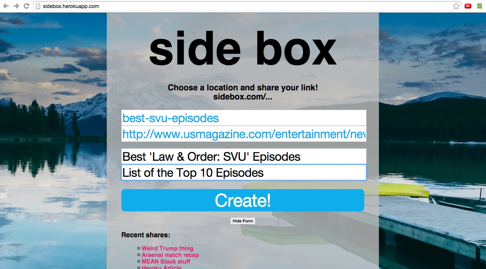
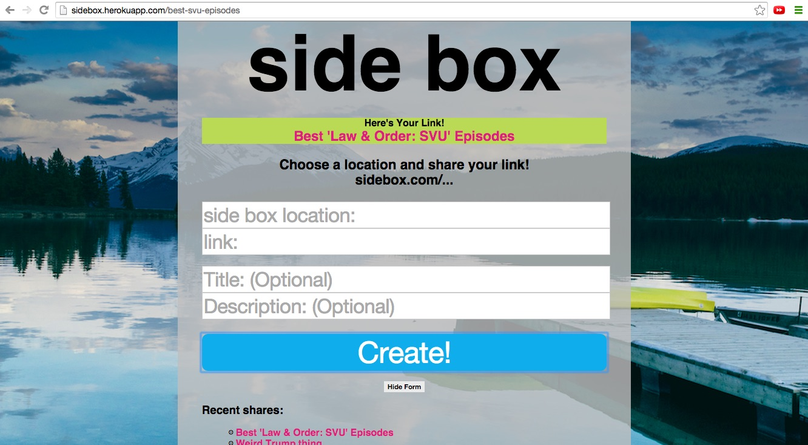

#README

Welcome to Side Box! Side Box helps you share URLs face-to-face. Simply paste a long URL and choose an easy path (e.g. ‘…com/mongo-article’) for sharing the link.

###CONTRIBUTING
As is standard for the 'react-rails' gem, all React component files can be found in the 'javascripts/components' directory.

Future goals for this project:
+ Add optional login functionality.
+ Add expiration and share-relevancy features.
+ Add hover/popup information for past shares.

Please fork and contribute!

###SIDE BOX USE
Choose a path to make sharing easy, paste a link, and add optional information:

Share the link by giving the Side Box url to a friend:

